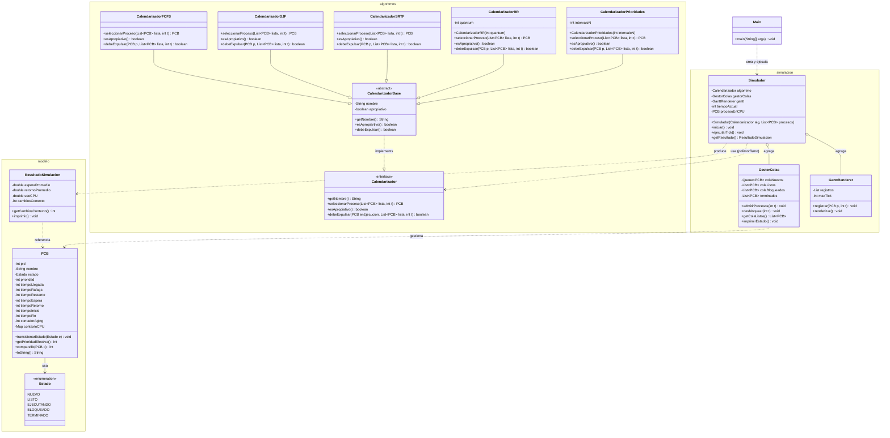

# Process Scheduler Simulator (Java)

This project implements a process scheduling simulator in Java as part of an Operating Systems course.

## Objective
The goal is to model how an operating system manages processes using different CPU scheduling algorithms. The simulator will represent processes using a Process Control Block (PCB), handle process queues, and evaluate performance metrics.

## Tech Stack
- Java 11+ (recommended Java 17)
- Standard Java libraries only

## UML Diagram

